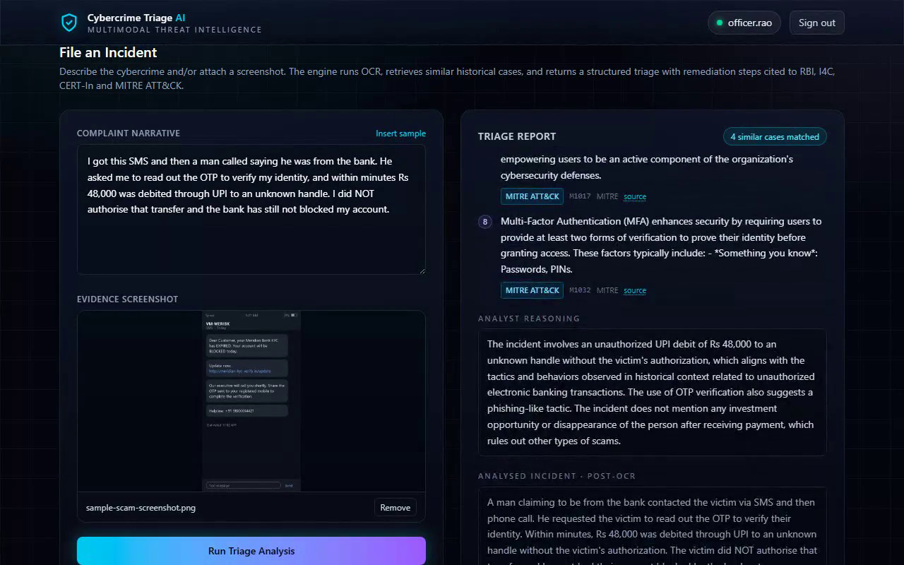
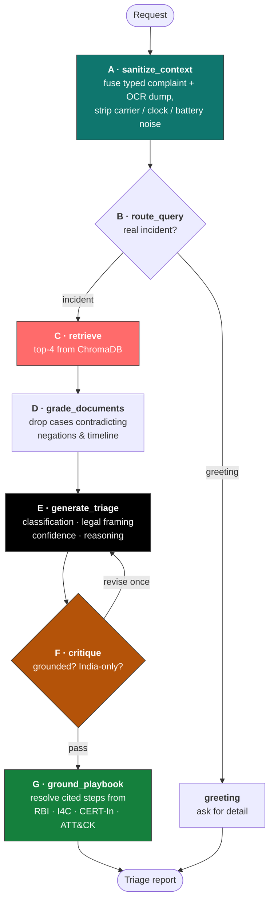

<div align="center">


# Cybercrime Triage AI — Agentic

### An agentic RAG pipeline that triages Indian cybercrime complaints from text *and* screenshots — and cites a real authority for every action it recommends

Grounded in **300,999 historical cases** · Remediation sourced from **RBI · I4C · CERT-In · NPCI · DoT · SEBI · MITRE ATT&CK** · Runs entirely on local hardware · **Zero third-party API calls**

<br/>

[](https://www.python.org/)
[](https://langchain-ai.github.io/langgraph/)
[](https://fastapi.tiangolo.com/)
[](https://www.trychroma.com/)
[](https://ollama.com/)
[](https://attack.mitre.org/)
[](https://react.dev/)

<br/>

**[Problem](#the-problem)** · **[Architecture](#architecture)** · **[Sourced remediation](#sourced-remediation)** · **[Features](#features)** · **[Quickstart](#getting-started)** · **[API](#api-reference)** · **[Engineering notes](#engineering-notes)** · **[Demo](#demo)**

<br/>



<sub><em>Evidence screenshot on the left, structured triage on the right. Every step carries the authority that published it and a link to the instrument itself.</em></sub>

</div>

<div align="center">
<table>
<tr>
<td align="center" width="150"><h3>300,999</h3><sub>complaints indexed</sub></td>
<td align="center" width="150"><h3>7</h3><sub>graph nodes<br/>with feedback loops</sub></td>
<td align="center" width="150"><h3>45</h3><sub>playbook entries<br/>every one cited</sub></td>
<td align="center" width="150"><h3>0</h3><sub>uncited actions<br/>· external API calls</sub></td>
</tr>
</table>
</div>

---

## The problem

India's National Cybercrime Reporting Portal receives complaints faster than officers can
classify and route them. The delay between filing and triage is exactly the window in
which transferred funds become unrecoverable — the RBI's customer-protection circular
gives a victim **three working days** to notify their bank for zero liability, and the
1930 helpline's "golden hour" is shorter still.

A retrieval-augmented pipeline can classify those complaints. The harder problem is what
comes next: **the remediation advice.**

An LLM asked for mitigation steps will produce fluent, plausible, confident guidance that
is accountable to nothing. For a fraud victim deciding what to do in the next thirty
minutes, and for a cyber cell deciding what is legally required of them, "plausible" is
not good enough. Advice that cannot be traced to the authority that issued it cannot be
relied on, audited, or defended.

## The solution

This system separates the two jobs and gives each to whatever is actually competent at it.

<table>
<tr>
<td width="50%" valign="top">

**The model classifies.**

A LangGraph state machine sanitises OCR noise, retrieves comparable cases from 300,999
historical complaints, discards the ones that contradict the victim's account, and
produces a classification, an Indian legal framing, a confidence, and its reasoning.

</td>
<td width="50%" valign="top">

**The playbooks prescribe.**

Every actionable step is resolved from a versioned corpus of published Indian regulatory
guidance and MITRE ATT&CK. Selection is a deterministic tag match — it costs nothing and
**cannot hallucinate.** Each step carries its issuing authority and a URL.

</td>
</tr>
</table>

The result is a report where the classification is clearly marked as model-generated and
provisional, and every action a victim or analyst is told to take is attributable.

> This is the agentic successor to
> **[cybercrime-triage-rag](https://github.com/sridarsh7858/cybercrime-triage-rag)**, which
> implements the same problem as a linear `retrieve → stuff → generate` chain. See
> [what changed](#what-the-agentic-rewrite-changed) for the measured differences.

### Why fully local matters here

Cybercrime complaints contain victim names, cities, transaction amounts, and account
identifiers. This pipeline sends **zero data to any third-party API** — embeddings,
inference, and OCR all run on-device via Ollama and EasyOCR. That is a hard requirement
for this class of PII, not a cost optimisation. The one network dependency, MITRE ATT&CK,
is fetched offline ahead of time and committed to the repo.

---

## Architecture

Rather than a linear chain, requests move through an explicit state machine. Cheap
deterministic calls make the routing and grading decisions; the single expensive
generation step runs only when it is warranted.



Every node receives the whole state and returns a *partial* update, which LangGraph merges
back in. Three capabilities fall out of this shape that a linear chain cannot express:

| Node | Why it needs its own step |
| --- | --- |
| **A · OCR sanitation** | Screenshots carry a carrier name, a clock, and a battery percentage. Concatenated blindly into a prompt, "Sprint" becomes a suspect. Node A rewrites the fused input down to the incident, preserving negations and event order. |
| **D · Negative-constraint grading** | Semantic similarity happily returns a case about a *closed* account when the victim said the bank did **not** close theirs. The grader reads the retrieved set against the victim's stated facts and drops contradictions. |
| **F · Hallucination critic** | The retrieved corpus is US-sourced (CFPB complaints), used only for scam *mechanics*. A critic plus a deterministic regex guard keep US agencies and statutes out of an India-only report, bouncing the report back for one revision. |

---

## Sourced remediation

This is the part that distinguishes the project. Node G resolves both remediation tracks
from versioned corpora in `app/data/playbooks/` — never from the model.

| Corpus | Entries | Covers | Issuing authorities |
| --- | --- | --- | --- |
| `india_consumer.json` | 16 | victim-facing actions | RBI · I4C/MHA · NPCI · CERT-In · DoT · SEBI |
| `india_soc.json` | 13 | analyst-facing actions | RBI circulars · CERT-In §70B Directions · CFCFRMS · BSA 2023 |
| `mitre_attack.json` | 16 | TTP-level mitigations | MITRE ATT&CK Enterprise v19.1 *(generated)* |

Anchor citations include the RBI circular on
[limiting customer liability in unauthorised electronic banking transactions](https://www.rbi.org.in/Scripts/NotificationUser.aspx?Id=11040)
(the three-working-day zero-liability window, 10-day shadow credit, 90-day resolution),
the [CERT-In Directions of 28 April 2022](https://www.cert-in.org.in/PDF/CERT-In_Directions_70B_28.04.2022.pdf)
(six-hour incident reporting, 180-day log retention, NTP synchronisation), the
[1930 helpline and NCRP](https://cybercrime.gov.in/), and
[Sanchar Saathi](https://sancharsaathi.gov.in/) for SIM-swap correlation.

### Provenance is part of the API contract

Every step is an object, not a string, and declares where it came from:

| `origin` | Badge | Meaning |
| --- | --- | --- |
| `playbook` | **Sourced** | Published Indian regulatory guidance. Carries authority, instrument, and URL. |
| `mitre` | **MITRE ATT&CK** | MITRE's own mitigation prose, with its M-ID and technique mapping. |
| `analyst` | **AI analyst** | Model-generated. Only ever appears on the greeting route and the provisional legal classification — **never** on a remediation step. |

### Refreshing the ATT&CK slice

```bash
python scripts/refresh_playbooks.py
```

Downloads MITRE's official Enterprise ATT&CK STIX release (~50 MB, public, no API key),
keeps only the techniques that genuinely occur in consumer financial fraud — phishing,
spearphishing voice, MFA request generation and interception, impersonation, remote-access
tooling, financial theft — resolves them to the mitigations MITRE publishes, and writes a
compact corpus. Mitigation text is MITRE's own; the script selects and reshapes, it never
paraphrases.

Enterprise-only mitigations (Active Directory configuration, network segmentation,
developer guidance) are explicitly excluded — real MITRE guidance, but meaningless for a
UPI fraud case, and leaving them in is how a triage report ends up telling a cyber cell to
tune group policy.

---

## Features

| Capability | What it does |
| --- | --- |
| **Agentic state machine** | Seven LangGraph nodes with conditional routing and a revision loop, not a fixed chain. Greetings short-circuit before any retrieval or generation. |
| **Multimodal intake** | Text narrative, evidence screenshot, or both. OCR is kept *separate* from the typed query so Node A can sanitise it rather than the pipeline blindly concatenating noise. |
| **Cited remediation** | Both tracks resolved from published regulatory playbooks with authority, instrument, and URL on every step. Zero uncited actions. |
| **Dual-track output** | A plain-English victim track and a technical SOC track, each drawn from its own corpus. |
| **Narrative-driven tagging** | Playbook tags are inferred from the incident text as well as the classification, so the right guidance still surfaces when a small model returns a vague label. |
| **Jurisdiction enforcement** | An LLM critic *and* a deterministic regex guard, where the regex overrules a passing verdict. Output is India-only by construction. |
| **Fail-fast startup** | The API refuses to boot against a missing or empty collection instead of silently returning zero matches. |
| **Non-blocking OCR** | EasyOCR is CPU-bound and synchronous; it runs in a threadpool so one upload cannot stall every other request. |
| **Reproducible demo** | A scripted Playwright walkthrough boots both servers, drives the UI, and records the preview video — see [Demo](#demo). |

---

## Tech stack

| Layer | Technology |
| --- | --- |
| Orchestration | **LangGraph** — `StateGraph` with conditional edges and a revision cycle |
| API | FastAPI, Uvicorn, Pydantic v2 |
| RAG plumbing | LangChain (LCEL), `langchain-chroma`, `langchain-ollama` |
| Vector store | ChromaDB (SQLite persistence, HNSW index) |
| Embeddings | `nomic-embed-text` via Ollama |
| LLM | Llama 3.2 via Ollama — two handles: `temp=0` for routing/grading/critique, `temp=0.2` for generation |
| Threat intel | MITRE ATT&CK Enterprise STIX v19.1 |
| OCR | EasyOCR (PyTorch backend) |
| Frontend | React 18, Vite 6, Tailwind CSS 4, React Router 6 |
| Demo tooling | Playwright, `imageio-ffmpeg` |

---

## Getting started

### Prerequisites

- **Python 3.12** (see `.python-version`)
- **Node 18+**
- **[Ollama](https://ollama.com)** running locally, with both models pulled:

  ```bash
  ollama pull nomic-embed-text
  ollama pull llama3.2
  ollama list          # confirm both appear
  ```

### 1. Install

```bash
git clone https://github.com/sridarsh7858/cybercrime-triage-agentic-rag.git
cd cybercrime-triage-agentic-rag

python -m venv .venv
.venv\Scripts\activate          # Windows
# source .venv/bin/activate     # macOS / Linux

pip install -r requirements.txt
```

### 2. Provide the vector store — required before first run

> [!IMPORTANT]
> **The index is not in this repository.** It is ~1.7 GB of generated files, far past
> GitHub's limits, so `/data/` is gitignored. `app/services/chroma_service.py` asserts a
> non-zero document count at import and raises `RuntimeError` if the store is missing, so
> this step cannot be skipped.

The pipeline expects a ChromaDB store at `data/ChromaDB_Indian/`, collection name
`langchain`, embedded with `nomic-embed-text` — see `app/core/config.py`. The
[linear-RAG sibling repo](https://github.com/sridarsh7858/cybercrime-triage-rag) ships a
resumable CSV → ChromaDB ingestion script (`scripts/build_db.py`) that produces a
compatible store.

### 3. Run the backend

```bash
uvicorn app.main:app --reload
```

A healthy startup prints:

```
[chroma] Collection 'langchain' loaded with 300999 documents
[playbook] loaded  16 steps from india_consumer.json
[playbook] loaded  13 steps from india_soc.json
[playbook] loaded  16 steps from mitre_attack.json
[ocr] Initializing EasyOCR Engine...
```

- Health check → <http://localhost:8000/health>
- Interactive OpenAPI docs → <http://localhost:8000/docs>

### 4. Run the frontend

```bash
cd frontend
npm install
cp .env.example .env          # VITE_API_URL — defaults to http://localhost:8000
npm run dev
```

Open <http://localhost:5173>, sign in with any username, paste a complaint (or click
**Insert sample**), optionally drop in a screenshot, and hit **Run Triage Analysis**.

---

## API reference

### `POST /api/v1/analyze`

Multipart form. At least one field is required. Images are capped at 10 MB.

| Field | Type | Description |
| --- | --- | --- |
| `query` | string | The complaint narrative |
| `file` | image | Evidence screenshot (PNG / JPG / WEBP) |

```bash
curl -X POST http://localhost:8000/api/v1/analyze \
  -F "query=A caller posing as a bank official said my KYC expired. I shared the OTP and Rs 48,000 was debited via UPI. I did NOT authorise it." \
  -F "file=@assets/sample-scam-screenshot.png"
```

```jsonc
{
  "query": "A man claiming to be from the bank contacted the victim via SMS...",  // post-OCR, sanitised
  "retrieved_context_count": 4,
  "threat_classification": "KYC OTP fraud (vishing)",
  "legal_category": "Unauthorised electronic banking transaction under RBI circular DBR.No.Leg.BC.78/09.07.005/2017-18",
  "consumer_mitigation_steps": [
    {
      "text": "Call the 1930 National Cyber Crime Helpline immediately. Reporting inside the 'golden hour' lets the CFCFRMS push a hold to the beneficiary bank before the money is withdrawn.",
      "origin": "playbook",
      "authority": "Indian Cyber Crime Coordination Centre (I4C), Ministry of Home Affairs",
      "source": "National Cyber Crime Reporting Portal / 1930 helpline",
      "url": "https://cybercrime.gov.in/",
      "reference_id": "IN-CONS-001"
    }
  ],
  "soc_investigation_playbook": [ /* same shape, incl. origin: "mitre" entries */ ],
  "confidence": "high",                 // high | medium | low | n/a
  "route_taken": "retrieve",            // greeting | retrieve
  "reasoning": "The incident involves an unauthorized UPI debit...",
  "incident_tags": ["generic", "impersonation", "kyc", "otp", "upi"]
}
```

`400` neither field supplied · `413` image over 10 MB · `415` non-image upload · `500` pipeline failure.

### `GET /health`

```json
{ "status": "online", "database": "ChromaDB SQLite Connected" }
```

---

## Project structure

```
app/
  api/analyze_router.py         Multipart intake, upload limits, threadpool OCR
  core/config.py                Paths, model names, collection name
  data/playbooks/               Trusted-source corpora — committed, versioned
    india_consumer.json           victim actions   (RBI · I4C · NPCI · CERT-In · DoT · SEBI)
    india_soc.json                analyst actions  (RBI · CERT-In §70B · CFCFRMS · BSA 2023)
    mitre_attack.json             generated from MITRE's STIX release
  schemas/incident_schemas.py   TriageStep + AnalysisResponse contracts
  services/
    agentic_rag_service.py      The LangGraph state machine — all seven nodes
    playbook_service.py         Deterministic tag match over the corpora
    chroma_service.py           Vector store connection + similarity search
    ocr_service.py              EasyOCR wrapper
frontend/
  src/pages/Dashboard.jsx       Intake form + provenance-aware report rendering
scripts/
  refresh_playbooks.py          MITRE ATT&CK STIX -> compact fraud-relevant corpus
  record_preview.py             Playwright walkthrough -> assets/preview.mp4
  make_sample_screenshot.py     Generates the synthetic evidence screenshot
data/                           Gitignored — the generated vector store
```

---

## Engineering notes

Decisions worth calling out, several of which were reversals forced by measurement.

- **The model classifies; it does not prescribe.** The first implementation asked the
  model for remediation steps and merged them against the playbooks. Measured on a live
  run, **roughly four in five generated steps were paraphrases** of the sourced guidance
  the model had just been shown, and no lexical similarity threshold — Jaccard,
  containment, stemmed containment — separated paraphrase from addition reliably. Removing
  the step fields from the generation schema entirely deleted ~60 lines of fragile
  heuristic, halved latency (57s → 29s), cut the report from 27 steps to 15, and took
  uncited actions to zero. Sharpening the prompt around classification alone also moved
  the output from *"Financial Fraud"* to *"KYC OTP fraud (vishing)"* with the correct RBI
  circular attached.

- **Anchor steps cannot be ranked out.** Specificity-based ranking pushed *"call 1930
  inside the golden hour"* off the end of the list in favour of incident-specific entries
  — dropping the single action that most affects whether the money is recoverable. Entries
  flagged `always` are now reserved a slot before ranking runs.

- **Tag inference reads the narrative, not just the classification.** On a digital-arrest
  case Llama 3.2 misclassified the incident outright, yet the correct guidance still
  surfaced, because `digital_arrest` was matched from the victim's own words. This is what
  makes a small local model tolerable for the classification step.

- **The jurisdiction regex overrules the critic.** A small critic model regularly waves
  through a report naming the FTC. The deterministic guard is not a second opinion — a
  match forces a revision even when the LLM critic passed.

- **Instruction-tuned preambles are not incident text.** Node A was emitting *"Here is the
  cleaned paragraph describing only the actual incident: …"*, which then polluted the
  retrieval query, the generator prompt, and the text shown to the citizen. Stripped, with
  a guard so a legitimate mid-sentence colon survives.

- **OCR off the event loop.** EasyOCR is synchronous and CPU-bound; running it inline in
  an `async` endpoint stalled every concurrent request for its duration. It now runs in a
  threadpool, and uploads are capped at 10 MB and content-type checked.

- **Fail loudly on an empty collection.** LangChain's Chroma wrapper silently creates an
  empty collection when the requested name doesn't exist, turning a config typo into
  "0 similar matches" rather than an error.

### What the agentic rewrite changed

Against the [linear-chain original](https://github.com/sridarsh7858/cybercrime-triage-rag):

| | Linear RAG | Agentic |
| --- | --- | --- |
| Control flow | `retrieve → stuff → generate` | 7-node graph, conditional routing, revision loop |
| OCR handling | concatenated into the prompt | sanitised in a dedicated node |
| Bad retrievals | passed straight through | graded against negations and timeline |
| Cheap inputs | full pipeline every time | greetings short-circuit before retrieval |
| Remediation | generated by the model | resolved from cited playbooks |
| Attribution | none | authority + instrument + URL per step |

---

## Limitations & roadmap

Stated plainly — this is a working prototype, not a deployed system:

- **The legal classification is model-generated and can be wrong.** On one run Llama 3.2
  produced *"Section 43A of the Indian Penal Code"* — 43A is the IT Act, and the IPC is
  superseded by the BNS 2023. The field is badged **AI analyst · provisional** in the UI
  for exactly this reason. Constraining it to an enum derived from the playbook corpus is
  the obvious next fix.
- **Authentication is demo-only.** The login accepts any username and persists to
  `localStorage`; the API has no auth at all. Do not expose this to a network as-is.
- **Retrieval is unfiltered.** Metadata is indexed but not used to constrain search.
- **No evaluation harness.** Retrieval and classification quality are assessed
  qualitatively; a labelled set with recall@k is the highest-value addition.
- **OCR is English-only.** `easyocr.Reader(['en'])`.
- **Playbook coverage is hand-curated.** 29 India entries cover the common fraud
  typologies well, but breadth is bounded by what has been transcribed from the source
  instruments.
- **Single-process, synchronous inference.** A task queue would be needed for real
  concurrency.

---

## Demo

A scripted [Playwright](https://playwright.dev/) walkthrough — it boots both servers,
drives the UI through five scenes, tears the servers down, and transcodes the capture:

```bash
uv pip install playwright imageio-ffmpeg
python -m playwright install chromium

python scripts/record_preview.py
```

<div align="center">

<video src="https://github.com/sridarsh7858/cybercrime-triage-agentic-rag/raw/main/assets/preview.mp4" controls muted width="92%"></video>

<sub><em>If the player doesn't load, <a href="assets/preview.mp4">download the recording directly</a>.</em></sub>

</div>

**Sign in → describe the incident → attach an evidence screenshot → run the triage →
scroll the full sourced report.**

The attached screenshot is `assets/sample-scam-screenshot.png`: a synthetic phishing SMS
deliberately padded with the carrier name, clock, and battery percentage that Node A
exists to strip. The report's **Analysed Incident · post-OCR** block shows what actually
reached the model — none of that chrome survives — so the recording *demonstrates* OCR and
sanitation rather than asserting them. The bank is fictitious on purpose: a demo asset
should not be a ready-made phishing message attributed to a real institution.

| Flag | Effect |
| --- | --- |
| `--skip-analysis` | UI tour without submitting — seconds instead of minutes, and needs neither Ollama nor the vector store |
| `--analysis-timeout N` | seconds to wait for the report (default 480) |
| `--headed` | show the browser while recording |

Regenerate the evidence screenshot with `python scripts/make_sample_screenshot.py`.

---

## Acknowledgements

Built with [LangGraph](https://langchain-ai.github.io/langgraph/),
[LangChain](https://www.langchain.com/), [ChromaDB](https://www.trychroma.com/),
[Ollama](https://ollama.com/), and [EasyOCR](https://github.com/JaidedAI/EasyOCR).

Remediation guidance is reproduced from published material by the
[Reserve Bank of India](https://www.rbi.org.in/), the
[Indian Cyber Crime Coordination Centre](https://i4c.mha.gov.in/),
[CERT-In](https://www.cert-in.org.in/), [NPCI](https://www.npci.org.in/), the
[Department of Telecommunications](https://sancharsaathi.gov.in/),
[SEBI](https://www.sebi.gov.in/), and [MITRE ATT&CK](https://attack.mitre.org/).

<div align="center">
<sub>This tool assists triage. It is not legal advice, and the classification it produces is provisional.</sub>
</div>
